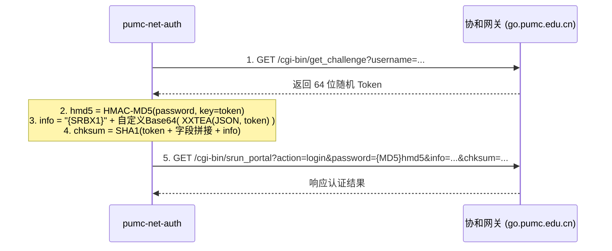

# pumc-net-auth

[](https://golang.org)
[](https://github.com/Miyamiz39/pumc-net-auth/releases)
[](LICENSE)

北京协和医学院（PUMC）校园网（深澜 Srun Portal 网关，`go.pumc.edu.cn`）的自动登录、掉线重连与后台保活工具。

---

## 特性

- **开箱即用**：Go 编写，编译为无依赖单文件可执行程序，常驻后台内存占用约 3MB。
- **无窗口静默运行**：Windows 下双击或通过系统自启运行时不显示命令行黑框；在终端下带参运行时自动复用当前控制台输出日志。
- **纯协议实现**：基于网关前端脚本（`Portal.js`）逆向实现，直接通过 HTTP 接口完成 Challenge-Response 握手与认证，无需安装或调用无头浏览器。
- **状态机保活**：周期性结合 HTTP 探测与 TCP 保持，避免因空闲超时被网关下线；确认掉线后自动重登，并具备异常连续失败退避机制。
- **跨平台支持**：提供 Windows、Linux（x86_64 / arm64）及 macOS（Apple Silicon / Intel）编译产物。

---

## 运行机制

程序每 30 秒执行一次检测循环：

```
[检测周期 (30s)]
  ├─ HTTP HEAD → www.baidu.com (网络连通性探测)
  ├─ TCP Hold 10s → www.baidu.com:80 (会话保活)
  └─ 任一失败 → 增加失败计数

[连续失败 2 次]
  ├─ 查询网关在线状态 (rad_user_info)
  ├─ 已在线：清零失败计数（网络临时波动）
  └─ 未在线：发起 Srun 协议登录
       ├─ 成功 / 提示已在线 → 恢复正常保活
       └─ 失败：累计错误次数，若连续失败 5 次则休眠退避 5 分钟
```

---

## 协议流程与实现说明

深澜 Srun Portal 网关登录包含动态令牌获取与四重参数计算：



### 实现要点
- **密码处理**：使用动态 Token 作为密钥，对密码做 HMAC-MD5 散列（`{MD5}` 前缀）。
- **用户信息加密 (`info`)**：JSON 载荷经 XXTEA 加密后，使用深澜自定义的 64 字符字母表做 Base64 编码，并在头部追加 `{SRBX1}` 标识。
- **防篡改签名 (`chksum`)**：将 Token 与各个请求参数（包括加密后的 info）按固定次序拼接后计算 SHA-1 摘要。
- **XXTEA 循环末尾索引差异**：
  官方前端 `Portal.js` 中的加密实现为 `for (p = 0; p < n; p++)`。循环结束后变量 `p` 最终自增为 `n`，因此循环体外末尾块计算采用 `k[(n & 3) ^ e]`。移植到其他语言时需注意避免误用循环结束后的非自增索引（例如 Python 的 `for p in range(n)` 结束后 `p` 仍为 `n - 1`），否则将产生错误密文并导致网关返回 `auth_info_error`。

---

## 使用指南

### 1. 下载或编译

从 [Releases](https://github.com/Miyamiz39/pumc-net-auth/releases) 下载对应系统的预编译二进制文件，或从源码编译：

```bash
git clone https://github.com/Miyamiz39/pumc-net-auth.git
cd pumc-net-auth

# Windows (无控制台窗口模式)
go build -ldflags="-H windowsgui -s -w" -o pumc-net-auth.exe .

# Linux / macOS
go build -ldflags="-s -w" -o pumc-net-auth .
```

### 2. 配置文件

在程序同目录下创建 `config.json`（或放置于 `~/.pumc-net-auth/config.json`），模板参考 `config.example.json`：

```json
{
  "username": "2024xxxxxx",
  "password": "your_password_here",
  "portal_host": "go.pumc.edu.cn",
  "ac_id": 1,
  "keepalive_target": "www.baidu.com",
  "interval_seconds": 30,
  "tcp_hold_seconds": 10,
  "fail_threshold_relogin": 2,
  "fail_threshold_backoff": 5,
  "backoff_minutes": 5
}
```

### 3. 命令行操作

```bash
# 探测网关与 Token 计算（不发起真实登录）
./pumc-net-auth -probe

# 单次登录（网络中断时手动重连）
./pumc-net-auth -login-once

# 查看当前后台实例状态
./pumc-net-auth -status

# 停止后台实例
./pumc-net-auth -stop

# 前台运行（测试排障）
./pumc-net-auth
```

### 4. 设置 Windows 开机自启

1. 按下 `Win + R`，输入 `shell:startup` 打开自启动目录；
2. 为 `pumc-net-auth.exe` 创建快捷方式并移动到该目录下；
3. 用户登录后程序将自动在后台启动运行。

---

## 目录结构

```
pumc-net-auth/
├── main.go               # 主循环、命令行解析与状态管理
├── srun.go               # Srun 协议层（XXTEA、Base64、HMAC、SHA-1）
├── srun_test.go          # 协议层基准测试用例
├── platform_windows.go   # Windows 控制台挂载与进程管理
├── platform_posix.go     # Linux / macOS 信号与进程管理
├── config.example.json   # 配置示例文件
├── build.bat             # Windows 快捷编译脚本
├── python/               # Python 标准库参考实现与诊断工具
├── LICENSE               # MIT 协议
└── README.md
```

---

## 免责声明

- 本项目仅供北京协和医学院师生学习研究网络协议及个人宿舍设备保活使用，请勿用于违反校规或法律法规的用途。
- 请妥善保管包含个人凭证的 `config.json` 文件，避免泄露。

---

## 许可证

本项目遵循 [MIT License](LICENSE)。
