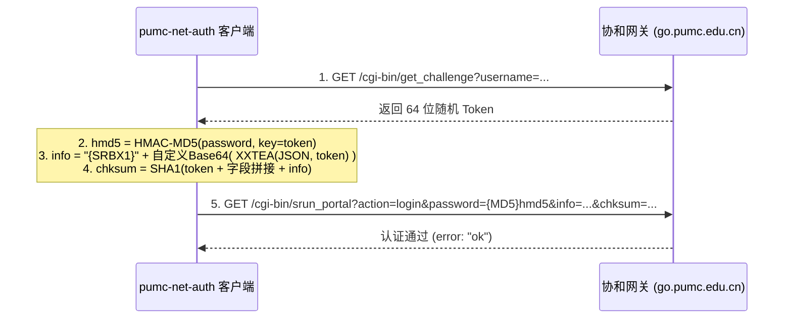

# pumc-net-auth · 协和校园网自动认证与保活守护

[](https://golang.org)
[](https://microsoft.com)
[](LICENSE)

针对**北京协和医学院（PUMC）**校园网（深澜 Srun Portal 网关，`go.pumc.edu.cn`）的极轻量、高可靠、开机自启的**断线重登与长效保活一体化工具**。

---

## ✨ 核心特性

- **极致轻量**：Go 原生编译单文件可执行程序（`.exe`），内存常驻仅占用 **约 3 MB**，CPU 消耗几乎为 0%。
- **双模自适应（Dual-Mode）**：
  - **开机自启 / 双击启动**：无黑框控制台、无前台窗口、无托盘干扰，完全静默在后台优雅守护。
  - **终端 CLI 启动**：自动挂载当前控制台，实时输出排障与探测日志，无需配置两套程序。
- **纯协议栈逆向**：完全复现官方 `Portal.js` 的 **Challenge-Response / HMAC-MD5 / XXTEA / 换表 Base64 / SHA-1** 握手协议，杜绝 Chromium/Playwright 等笨重浏览器方案（动辄 300MB+ 内存）。
- **稳健看门狗状态机**：
  - **心跳保活**：HTTP HEAD 探测公网连通性 + TCP Hold 保持会话活跃，防止校园网因空闲超时被踢下线。
  - **抖动过滤**：遭遇临时丢包不盲目重登，连续 2 次确认掉线才触发恢复机制。
  - **在线防踢**：重登前先向网关校验 `rad_user_info`，已在线则清零计数，避免重复握手引发多端踢出。
  - **指数退避**：连续 5 次重试失败自动休眠退避 5 分钟，防止网线断开时高频发包被校园网风控拉黑。

---

## 🏗️ 工作原理

```
[每 30 秒监测循环]
  ├─ HTTP HEAD → www.baidu.com (毫秒级公网探测)
  ├─ TCP Hold 10s → www.baidu.com:80 (维持连接活跃状态)
  └─ 两条任一失败 → fail_count++

[连续失败 2 次]
  ├─ rad_user_info 查询网关在线状态
  ├─ 已在线：清零 fail_count（判定为公网抖动）
  └─ 未在线：发起 Srun 协议握手重登
       ├─ 成功 / ip_already_online_error → 清零，恢复保活
       └─ 失败：fail_count 累计；连续 5 次失败进入 5 分钟安全退避
```

---

## 🔐 协议要点与逆向备忘

深澜网关在应用层实现了一套自定义的挑战认证链路：



> ⚠️ **XXTEA 移植核心踩坑点**：
> 在官方 `Portal.js` 的 `encode()` 函数中，`for (p = 0; p < n; p++)` 循环结束时，JavaScript 的 `var` 变量会自增到 `n`，因此循环体外最后一块的密钥索引必须是 `k[(n & 3) ^ e]`。如果误用部分编程语言的循环尾值（如 Python 的 `range(n)` 结束后 `p == n-1`），将导致密文全部错误，服务端统报 `auth_info_error`。本项目 Go 与 Python 实现均已完成字节级黄金向量校验。

---

## 🚀 快速上手

### 1. 获取程序

你可以直接从 [Releases](https://github.com/Miyamiz39/pumc-net-auth/releases) 下载编译好的单文件 `pumc-net-auth.exe`，或者在本地使用 Go 自行编译：

```bash
git clone https://github.com/Miyamiz39/pumc-net-auth.git
cd pumc-net-auth
go build -ldflags="-H windowsgui -s -w" -o pumc-net-auth.exe .
```

### 2. 配置账户

在程序同目录下复制一份 `config.json`（参考 `config.example.json`）：

```json
{
  "username": "2024xxxxxx",
  "password": "你的校园网密码",
  "portal_host": "go.pumc.edu.cn",
  "ac_id": 1,
  "keepalive_target": "www.baidu.com",
  "interval_seconds": 30,
  "tcp_hold_seconds": 10,
  "fail_threshold_relogin": 2,
  "fail_threshold_backoff": 5,
  "backoff_minutes": 5
}
```

> *配置文件也可放置在 `~/.pumc-net-auth/config.json`。*

### 3. 常用操作命令

```powershell
# 1. 探测模式（仅验证网关连接与 Token 算法，不发登录）
.\pumc-net-auth.exe -probe

# 2. 单次登录（网络中断时手动执行一键上线）
.\pumc-net-auth.exe -login-once

# 3. 启动后台守护模式（无黑框静默运行）
Start-Process .\pumc-net-auth.exe

# 4. 查看当前后台运行状态
.\pumc-net-auth.exe -status

# 5. 停止后台守护进程
.\pumc-net-auth.exe -stop
```

### 4. 设置 Windows 开机自启

只需将程序的快捷方式放入 Windows 自启动目录：
1. 按 `Win + R` 键，输入 `shell:startup` 回车打开自启目录。
2. 将 `pumc-net-auth.exe` 创建快捷方式并粘贴进去即可。
3. 以后每次开机登录桌面后，程序就会自动在后台静默保活。

---

## 📁 目录结构

```
pumc-net-auth/
├── main.go               # 守护主循环、双模 AttachConsole、命令行控制
├── srun.go               # Srun 协议栈（XXTEA、换表 Base64、HMAC、SHA1 校验）
├── srun_test.go          # 官方 Portal.js 黄金测试向量单元自测
├── config.example.json   # 配置文件模板
├── build.bat             # Windows 一键编译脚本
├── python/               # Python 纯标准库备用实现与诊断脚本
├── LICENSE               # MIT 许可证
└── README.md
```

---

## 📜 免责声明

- 本工具仅供北京协和医学院师生学习交流与个人宿舍网络保活使用，请勿用于非法用途。
- 请妥善保管好个人 `config.json` 文件，切勿将明文密码提交至公开代码仓库。

---

## 📄 License

本项目基于 [MIT License](LICENSE) 开源。
