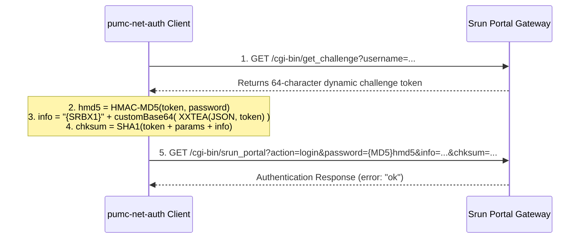

# pumc-net-auth

[](https://golang.org)
[](https://github.com/Miyamiz39/pumc-net-auth/releases)
[](LICENSE)

PUMC 校园网（深澜 Srun Portal 网关）自动登录、掉线重连与后台保活客户端（也适用采用其它深澜认证的高校）。

---

*在宿舍里的主机又被校园网踢下线了！远程桌面又双叒连不上了* ヽ(`Д´)ﾉ

**于是有了这个程序 ( •̀ ω •́ )✧**

## 特性

- **轻量独立**：Go 编写，静态编译为无外部依赖的单文件程序，常驻后台内存占用约 3MB。
- **无窗口静默运行**：Windows 环境下双击或系统自启时不显示控制台黑框；终端下执行自动挂载当前输出。
- **纯协议栈实现**：直接对接网关 HTTP 认证接口，无需安装或启动无头浏览器（Headless Browser）。
- **心跳保活与重连**：周期性结合网络探测与 TCP 保持，避免因空闲超时下线；异常断网后自动重登并支持退避保护。
- **全平台支持**：提供 Windows、Linux (x86_64 / arm64) 及 macOS (Apple Silicon / Intel) 预编译版本。

---

## 运行机制

程序默认每 30 秒执行一次检测循环：

```
[Keepalive Cycle (30s)]
  ├─ HTTP Probe → Target URL (Connectivity check)
  ├─ TCP Hold 10s → Target:80 (Session keepalive)
  └─ Fail count increments on failure

[Trigger: Fail count >= 2]
  ├─ Query gateway status (rad_user_info)
  ├─ If Online: Reset counter (transient network jitter)
  └─ If Offline: Initiate Srun authentication
       ├─ Success / Already Online: Resume keepalive
       └─ Failure: Backoff for 5 minutes after 5 consecutive failures
```

---

<details>
<summary><b>Protocol Specification (Challenge-Response Workflow)</b></summary>

### Authentication Sequence

The Srun Portal system utilizes a challenge-response mechanism over HTTP:



### Encryption & Signing Details

1. **Password Hashing (`hmd5`)**:
   Computed using HMAC-MD5 with the dynamic `token` as the secret key and user password as the message.
2. **User Payload (`info`)**:
   Constructed from user metadata (`username`, `password`, `ip`, `acid`, `enc_ver: "srun_bx1"`), encrypted via XXTEA using `token` as the key, and encoded with Srun's custom 64-character Base64 alphabet:
   `LVoJPiCN2R8G90yg+hmFHuacZ1OWMnrsSTXkYpUq/3dlbfKwv6xztjI7DeBE45QA`
3. **Integrity Checksum (`chksum`)**:
   Calculated as the SHA-1 digest of concatenated fields:
   `SHA1(token + username + token + hmd5 + token + acid + token + ip + token + n + token + type + token + info)`
4. **Engineering Note (XXTEA Loop Index Semantics)**:
   In the gateway's reference JavaScript implementation, `for (p = 0; p < n; p++)` leaves `p === n` upon loop termination due to `var` hoisting and the final increment. Implementations in languages with iterator-based loops (such as Python's `for p in range(n)`) must explicitly index the final round with `k[(n & 3) ^ e]` rather than relying on the trailing loop variable (`n - 1`), to avoid cipher mismatch and `auth_info_error`.

</details>

---

## 使用指南

### 1. 获取程序

从 [Releases](https://github.com/Miyamiz39/pumc-net-auth/releases) 下载对应系统的预编译文件，或自行编译：

```bash
git clone https://github.com/Miyamiz39/pumc-net-auth.git
cd pumc-net-auth

# Windows (无控制台窗口模式)
go build -ldflags="-H windowsgui -s -w" -o pumc-net-auth.exe .

# Linux / macOS
go build -ldflags="-s -w" -o pumc-net-auth .
```

### 2. 配置文件

在程序同目录下创建 `config.json`（参考 `config.example.json`）：

```jsonc
{
  "username": "your_username",       // 用户名 (学号, etc.)
  "password": "your_password",       // 密码 (明文保存所以千万注意文件保密！)
  "portal_host": "portal.your-campus.edu.cn", // 校园网认证页面的地址 (PUMC 为 go.pumc.edu.cn)
  // --- 以下保持默认即可 ---
  "ac_id": 1,
  "keepalive_target": "www.baidu.com",
  "interval_seconds": 30,
  "tcp_hold_seconds": 10,
  "fail_threshold_relogin": 2,
  "fail_threshold_backoff": 5,
  "backoff_minutes": 5
}
```

> *配置文件亦可放置于 `~/.pumc-net-auth/config.json`。*

### 3. 命令行操作

```bash
# 探测网关与 Token 算法（不发登录请求）
./pumc-net-auth -probe

# 单次登录（手动重连）
./pumc-net-auth -login-once

# 查看后台运行状态
./pumc-net-auth -status

# 停止后台实例
./pumc-net-auth -stop
```

### 4. 设置 Windows 开机自启

1. 按下 `Win + R`，输入 `shell:startup` 打开自启动目录；
2. 为 `pumc-net-auth.exe` 创建快捷方式并移动到该目录下即可。

---

## 目录结构

```
pumc-net-auth/
├── main.go               # 主循环、命令行参数与状态管理
├── srun.go               # Srun 协议实现（XXTEA、Base64、HMAC、SHA-1）
├── srun_test.go          # 协议基准自测用例
├── platform_windows.go   # Windows 控制台挂载与进程管理
├── platform_posix.go     # Linux / macOS 信号与进程管理
├── config.example.json   # 配置文件模板
├── build.bat             # Windows 一键编译脚本
├── python/               # Python 标准库备用实现与诊断脚本
├── LICENSE               # MIT 协议
└── README.md
```

---

## 免责声明

- 本项目仅供网络协议工程研究与个人宿舍设备网络保活使用，请勿用于违反校园网管理规定的用途。
- 请妥善保管包含个人凭据的 `config.json`，切勿提交至公开代码仓库。

---

## 许可证

本项目基于 [MIT License](LICENSE) 开源。
